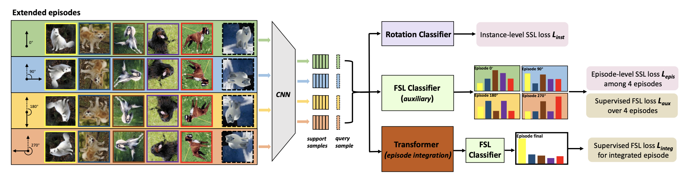

# IEPT: Instance-Level and Episode-Level Pretext Tasks For Few-Shot Learning (ICLR 2021)
The code repository for "[IEPT: Instance-Level and Episode-Level Pretext Tasks For Few-Shot Learning](https://openreview.net/pdf/a68102247933495b5b77811b3b5299cf97a108f4.pdf)".

## Abstract

In this work, we propose a novel Instance-level and Episode-level Pretext Task (IEPT) framework that seamlessly integrates SSL into FSL. Specifically, given an FSL episode, we first apply geometric transformations to each instance to generate extended episodes. At the instancelevel, transformation recognition is performed as per standard SSL. Importantly, at the episode-level, two SSL-FSL hybrid learning objectives are devised: (1) The consistency across the predictions of an FSL classifier from different extended episodes is maximized as an episode-level pretext task. (2) The features extracted from each instance across different episodes are integrated to construct a single FSL classifier for meta-learning.

### Prerequisites

The following items are required:

- Package: PyTorch-0.4+, torchvision, pyyaml and tensorboardX

- Dataset: please download raw dataset and put images into the folder data/miniImagenet/images, and the split .csv file into the folder data/miniImagenet/split. 

- Pre-trained weights: please download the [pre-trained weights](https://drive.google.com/drive/folders/10kWbiF2xgiOn_JO2YQEzvF_l_R7GDEEP?usp=sharing) of the encoder and put them under the saves/initialization/mini-imagenet folder.

### Data Preparation

#### MiniImageNet Dataset

The MiniImageNet dataset is a subset of the ImageNet that includes a total number of 100 classes and 600 examples per class. We follow the [previous setup](https://github.com/twitter/meta-learning-lstm), and use 64 classes as SEEN categories, 16 and 20 as two sets of UNSEEN categories for model validation and evaluation respectively. Note that we use the raw images which are resized to 92\*92 and then center croped to 84\*84.

#### TieredImageNet Dataset(TODO)

### Model Training

All the hyper-parameters for training our model are writen in the config/*.yaml files. We can train the 5way 1shot setting on MiniImageNet by running :

    $ python train.py --way 5 --shot 1 --cfg_file ./config/mini-imagenet/conv64.yaml

### Model Evaluating

You can run **eval.py** to evaluate a given model by:

    $ python eval.py --model_type ConvNet --dataset MiniImageNet --model_path ./checkpoints/XXX/XXX.pth --shot 1 --way 5 --gpu 0 --embed_size 64

where the trained model is stored as ./checkpoints/XXX/XXX.pth .

## Citation
If this repo helps in your work, please cite the following paper:

	@inproceedings{
  		zhang2021iept,
  		title={{IEPT}: Instance-Level and Episode-Level Pretext Tasks for Few-Shot Learning},
  		author={Manli Zhang and Jianhong Zhang and Zhiwu Lu and Tao Xiang and Mingyu Ding and Songfang Huang},
  		booktitle={International Conference on Learning Representations},
  		year={2021},
  		url={https://openreview.net/forum?id=xzqLpqRzxLq}
	}

## Acknowledgment
We thank the following repos for providing helpful components/functions in our work.
- [FEAT](https://github.com/Sha-Lab/FEAT)

- [ProtoNet](https://github.com/cyvius96/prototypical-network-pytorch)

- [MatchingNet](https://github.com/gitabcworld/MatchingNetworks)

- [PFA](https://github.com/joe-siyuan-qiao/FewShot-CVPR/)

- [Transformer](https://github.com/jadore801120/attention-is-all-you-need-pytorch)
